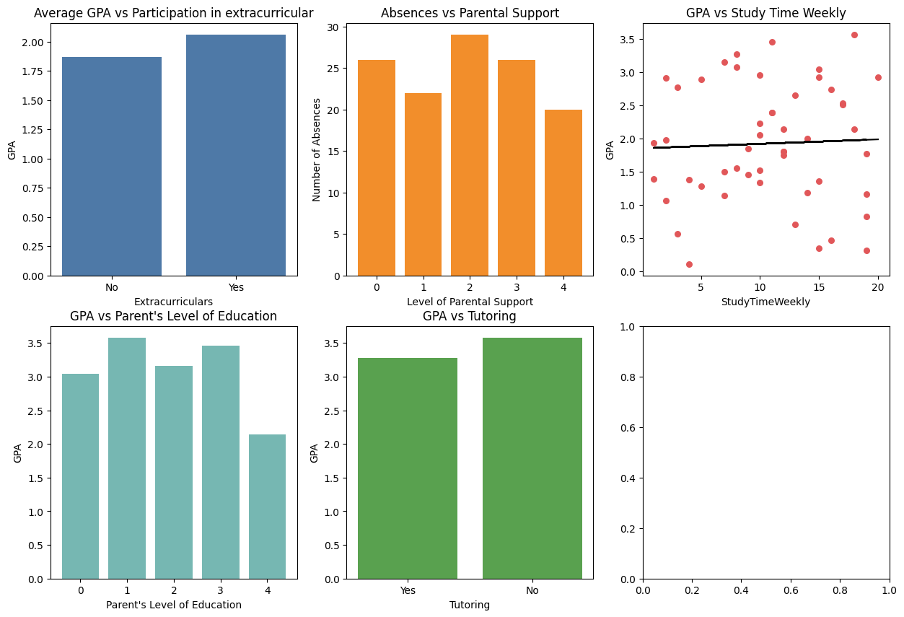

# Student grade and other related information analysis and visualization

This is a personal project I did to check the relationship between variuos data and check how they affect each other. The dataset was download on [Kaggle](https://www.kaggle.com/datasets/rabieelkharoua/students-performance-dataset)


## Table of contents

- [Overview](#overview)
  - [Screenshot](#screenshot)
  - [Links](#links)
- [My process](#my-process)
  - [Built with](#built-with)
  - [What I learned](#what-i-learned)
  - [Continued development](#continued-development)
  - [Useful resources](#useful-resources)
- [Author](#author)


## Overview

### Screenshot




### Links

- Solution URL: [Github Repository](https://github.com/Jadesola2/da-student-grade-dataset-analysis/)


## My process

### Built with

- Jupyter Notebook
- Matplotlib


### What I learned

For this project, I learnt to use to certain graphs for certain types of data (qualitative or quantitative) and that the graph might not always look preetws. I also learnt to use subplots.

I am proud of the following snippet:

```
main_df["Extracurricular"] = main_df["Extracurricular"].map ({
    0: "No",
    1: "Yes"
})

main_df["Tutoring"] = main_df["Tutoring"].map ({
    0: "No",
    1: "Yes"
})
```


### Continued development

For future projects, I hope to make use of a neater framework like Seaborn.


### Useful resources

- [Intellipaat Matplotlib Tutorial]() - This was my first time ever learning this python library and this video wad very beginner friendly and helped me grasp the imporotant concept

## Author

- Frontend Mentor - [@yourusername](https://www.frontendmentor.io/profile/yourusername)
- LinkedIn - [Jadesola Ojo](https://www.linkedin.com/in/jadesola-ojo-862421346)


